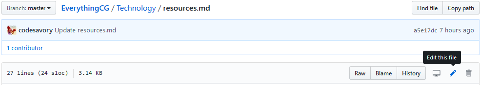
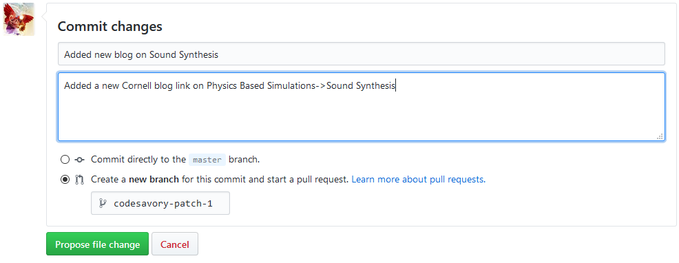

# EverythingCG
Knowledge hub to share and learn the state-of-the-art developments in computer graphics.

Computer Graphics being a very inter-disciplinary field can be handled from different perspectives, this is an initiative to conglomerate all the information in computer graphics divided into 3 main sub-topics - art, design and technology.

The aim of this repository is to share the latest developments in this field in terms of - research papers, major tools, job opportunities, top universities, active professors and researchers. The main objective is to have a centralized platform where people can contribute content for others to learn. It is an initiative to foster learning and development of computer graphics. Please note that this is just a repository re-directing to works of other creators across the world and I was not part of any of the works.

All the information shared in this repository will also be curated and shared as part of my website - https://everythingcg.com/

## Table of contents

### Art
- To be added soon

### Design
- To be added soon

### Technology
- [Fields](/Technology/fields.md)
  - [Character Animations](/Technology/Fields/character_animations.md)
  - [Facial Animations](/Technology/Fields/physics_based_simulations.md)
  - [Geometric Processing](/Technology/Fields/geometric_processing.md)
  - [Materials](/Technology/Fields/materials.md)
  - [Photogrammetry](/Technology/Fields/photogrammetry.md)
  - [Physics Based Simulations](/Technology/Fields/physics_based_simulations.md)
- [Opportunities](/Technology/opportunities.md)
- [Research Groups](/Technology/research_groups.md)
- [Researh Papers](/Technology/research_papers.md)
- [Resources](/Technology/resources.md)
- [Tools](/Technology/tools.md)

### Contributing

#### 1. Adding a new resource link

To add a new resource link, you can just click on the small edit button in the top-right
corner of the file under the respective section (see below).

This allows you to edit the file in Markdown. Simply add a row to the corresponding table in the
same format. Make sure that the table stays sorted (with the best result on top). 
After you've made your change, make sure that the table still looks ok by clicking on the
"Preview changes" tab at the top of the page. If everything looks good, go to the bottom of the page,
where you see the below form. 

Add a name for your proposed change, an optional description, indicate that you would like to
"Create a new branch for this commit and start a pull request", and click on "Propose file change".

#### 2. Adding a new field or sub-field

For adding a new dataset or task, you can also follow the steps above. Alternatively, you can fork the repository.
In both cases, follow the steps below:

1. If the field is completely new, create a new entry in **field.md** and create a new file under the **Fields** sub-directory Also link to it in the table of contents above.
1. If not, add an entry of your sub-field to the respective section of the corresponding file (in alphabetical order).
1. Briefly describe the field/sub-field and include relevant references. 
1. Add a reference link if available.
1. Copy the below table and fill in at least two results (including the state-of-the-art)
  for your sub-field. If your sub-field has other information/notes, add them to the right of `Link`.
1. Submit your change as a pull request.

Format: \<Sub-field Name>\<Description>\<Short Overview Link>

| Sub-field Name | Description   | Link  |
| -------------- |:--------------| ------|
| | | |
